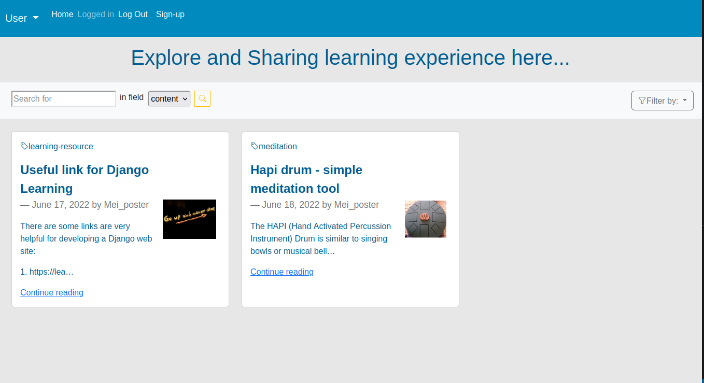
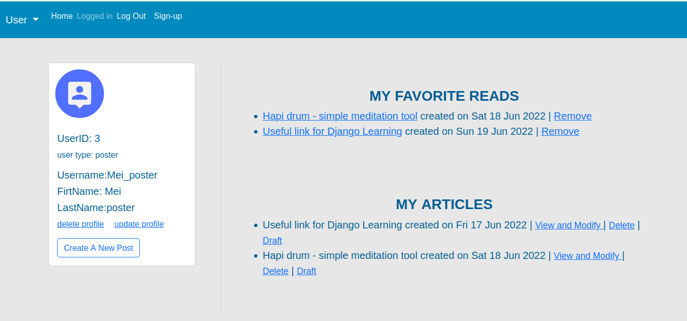
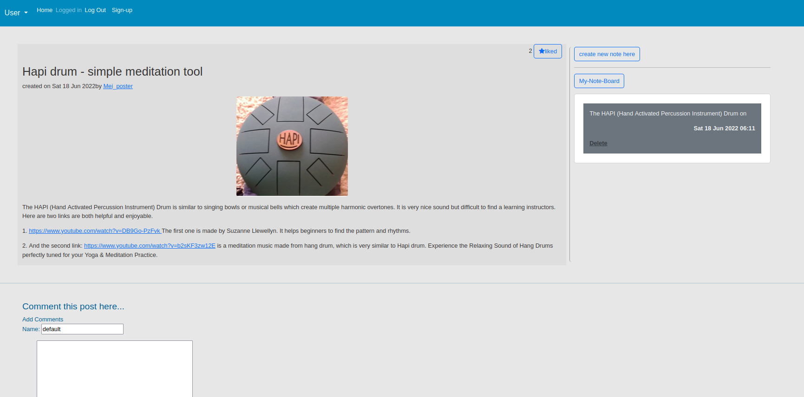

# lba - Learning Blogs App

## Introduction

  <p>Reading and writing blogs is a great way to learn. This app allows user to share experiences with others and learning new things through posting articles and organizing their own notes while reading an article as well as commenting articles to share opinions</p> 
  




## Deployment

The project is currently on heroku : https://lba-001.herokuapp.com/. The guest account is : test_poster amd password: Django2022.

## Functions

There are two tpyes of user upon register: "reader" and "poster".

<p>User "reader" with limited permissions can add favorite article, add notes to the articles and comments to user account.</p>
<p>User "poster" user will have more permissions including make draft and post their articles.</p>
<p>Any user can update or delete own account.
<p>Without an account or logged out, A visitor can still browse and comment articles.

## Run this project on your computer

<p>Firstly, make sure installed following plugins:</p>
- Pillow<br>
- ckeditor<br>
- django_static_fontawesome<br>
- django-storages<br>
- python-decouple<br>

<p>Then create the root file name ".env-example" to ".env", and create the following code lines:</p>
```
AWS_ACCESS_KEY_ID = 'put your own'
AWS_SECRET_ACCESS_KEY = 'put your own'
SECRET_KEY = 'put your own'```

## Updated Function:

<ul>
<li>Set a real email backend to recovery password</li>
<li>Registered User email set to unique because of above</li>
<li>Comments trees created!</li>
<li>not use decouple to hide password, changed to use environment variables, less plugin...</li>
</ul>
